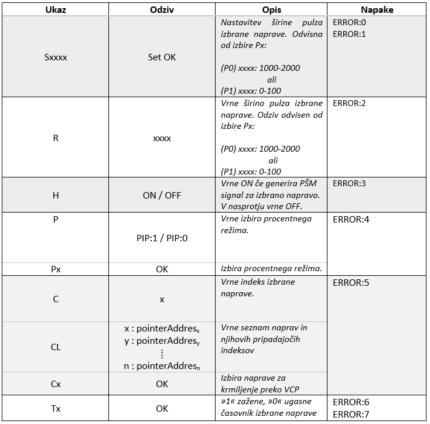
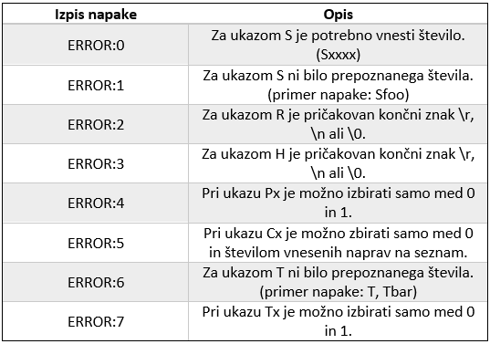

# RC-Lib

Knjižnica je še v fazi razvoja, prav tako tudi git repo.

Knjižnica trenutno vključuje:
- Generiranje PŠM za več naprav
- Vodenje PŠM preko USB VCP vmesnika

Za dodati:
- [] Implimentacija vračanja napak funkcij
- [] Implimentacija PPM (pulse-position modulation) generiranje in branje
- [x] Funkcija za izbiro naprave na seznamu s parametrom *dev

## Ukazi USB VCP vmesnika

